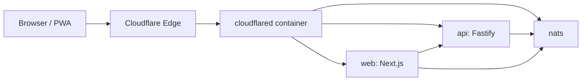
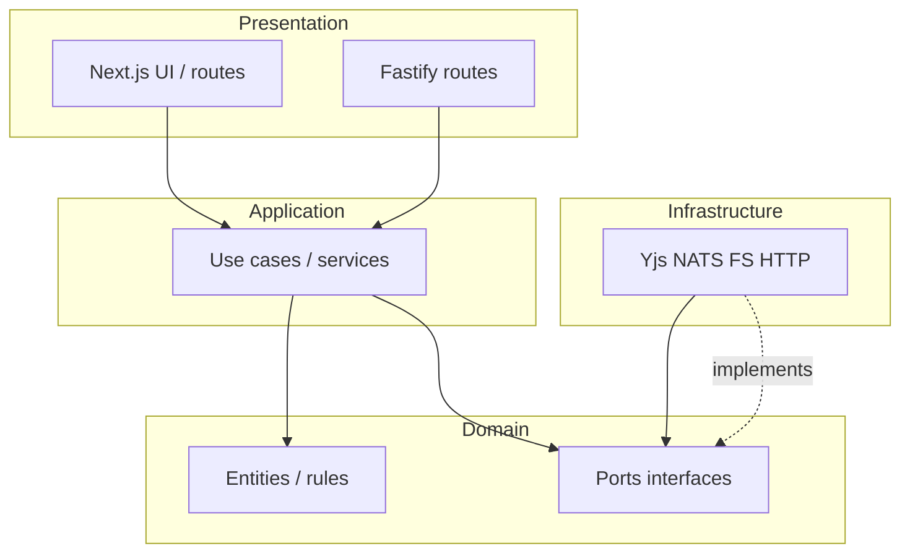
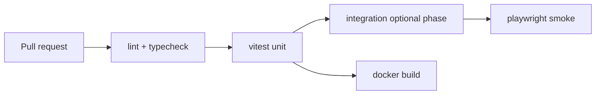

# Feature list — Flowboard

แอป PWA ออกแบบ workflow คล้าย Miro + Trello (board, roadmap, tasks, plan)  
Stack: Next.js (TS), Tailwind, shadcn/ui, **modern UX** — Fastify, NATS, P2P, `npm run dev`, compose dev/staging, Cloudflare Tunnel

สถานะในเอกสาร: **Planned** = วางแผน | **Later** = phase ถัดไป | **Cut** = ตัดออกชั่วคราว

---

## 1. Core product

| # | Feature | Description | Status |
|---|---------|-------------|--------|
| 1.1 | Multi-workflow | สร้างและทำงานได้หลาย workflow แยกกัน | Planned |
| 1.2 | Workflow identity | แต่ละ workflow มี `id` ใน manifest (ไม่ผูก path ดิสก์) | Planned |
| 1.3 | Page-based UI | แต่ละ workflow มีหลายหน้า (Page) สลับใน shell เดียวกัน | Planned |
| 1.4 | Page kinds | Board, Roadmap, Tasks, Plan — component แยกตาม kind | Planned |
| 1.5 | Unified document model | ข้อมูลทุก page อยู่ใน CRDT document เดียว (Yjs) | Planned |
| 1.6 | Schema versioning | `schemaVersion` + migration เมื่อเปิดไฟล์เก่า | Planned |
| 1.7 | Recent workflows | รายการเปิดล่าสุด (IndexedDB / local metadata) | Planned |

---

## 2. Page modules (content)

### 2.1 Design Board — whiteboard แบบ Miro

เป้าหมาย: หน้า **Board** เป็น **design app / infinite canvas** ใช้งานได้ใกล้ **Miro** (วางแผน, brainstorm, diagram) — แบ่ง Phase; Phase 1 เริ่ม core แล้วขยายความสามารถ

#### 2.1.A Canvas & navigation

| # | Feature | Description | Phase |
|---|---------|-------------|-------|
| 2.1.1 | Infinite canvas | พื้นที่ไม่จำกัด (virtual) | 1 |
| 2.1.2 | Pan & zoom | ลากพื้นที่, scroll/zoom; **pinch-to-zoom** บน touch | 1 |
| 2.1.3 | Minimap (optional) | มุมมองย่อทั้ง board | 3 |
| 2.1.4 | Grid / dot background | แสดง/ซ่อน grid; **snap to grid** | 2 |
| 2.1.5 | Fit to screen / reset zoom | โฟกัสเนื้อหาทั้งหมด | 2 |

#### 2.1.B Objects & tools (Miro-like)

| # | Feature | Description | Phase |
|---|---------|-------------|-------|
| 2.1.6 | Sticky notes | สี, ข้อความ, resize | 1 |
| 2.1.7 | Text box | ข้อความอิสระบน canvas | 2 |
| 2.1.8 | Shapes | สี่เหลี่ยม, วงกลม, สามเหลี่ยม, ลูกศร | 2 |
| 2.1.9 | Connectors | เส้นเชื่อมระหว่าง object + **anchor points** | 2 |
| 2.1.10 | Freehand draw | ปากกาวาดเส free | 3 |
| 2.1.11 | Frames / sections | กรอบจัดกลุ่มเนื้อหา (เหมือน Miro frame) | 3 |
| 2.1.12 | Images | วางรูปจากไฟล์; เก็บใน `assets/` | 2 |
| 2.1.13 | Embed (link preview) | แสดงการ์ดลิงก์ | Later |

#### 2.1.C Selection & editing

| # | Feature | Description | Phase |
|---|---------|-------------|-------|
| 2.1.14 | Select / move / resize | คลิกเลือก, ลากย้าย, จับมุม resize | 1 |
| 2.1.15 | Multi-select | กล่อง lasso หรือ Shift+click | 2 |
| 2.1.16 | Group / ungroup | จัดกลุ่ม object | 3 |
| 2.1.17 | Duplicate, copy/paste | คีย์ลัด Ctrl+C/V | 2 |
| 2.1.18 | Delete, undo / redo | ประวัติ local + sync CRDT | 1 |
| 2.1.19 | Z-order | นำไปหน้า/หลัง | 2 |
| 2.1.20 | Align & distribute | จัดแนวหลายชิ้น | 3 |
| 2.1.21 | Lock object | ล็อกไม่ให้ลาก (optional) | 3 |

#### 2.1.D Collaboration on canvas (live session)

| # | Feature | Description | Phase |
|---|---------|-------------|-------|
| 2.1.22 | Multiplayer cursors | ดู §4 (NATS) | 2 |
| 2.1.23 | Follow user viewport (optional) | ตามมอง host/เพื่อน | Later |
| 2.1.24 | Live edits on canvas | Yjs sync ทุก object | 2 |

#### 2.1.E Export & performance

| # | Feature | Description | Phase |
|---|---------|-------------|-------|
| 2.1.25 | Export PNG / PDF | ส่งออกทั้ง board หรือเฉพาะ frame | 3 |
| 2.1.26 | Large board performance | virtualize / cull off-screen; debounce render | 2 |

#### 2.1.F Implementation (แนวทางเทคนิค)

| # | Feature | Description | Status |
|---|---------|-------------|--------|
| 2.1.f1 | Canvas engine | ชั้น `features/board/canvas` — แยกจาก shell UI; พิจารณา **tldraw** (SDK) / **Konva+react-konva** / custom | Planned |
| 2.1.f2 | Model in CRDT | object เป็น Y.Map/Y.Array ใน page subdoc — id, type, transform, props | Planned |
| 2.1.f3 | Tool palette | toolbar แบบ Miro (เลือกเครื่องมือ, สี, stroke) | Planned |

**ไม่เป้า parity 100% Miro ใน v1:** voting, timer, integrations (Jira/Slack), SSO enterprise, version timeline แบบ Enterprise — **Later** ถ้าต้องการ

### 2.2 Roadmap

| # | Feature | Description | Status |
|---|---------|-------------|--------|
| 2.2.1 | Timeline / milestones | จุดหมายบนเส้นเวลา | Planned |
| 2.2.2 | Swimlanes | แยก track (ทีม/ธีม) | Later |
| 2.2.3 | Dependencies | ลิงก์งานพึ่งพากัน | Later |

### 2.3 Tasks (Trello-like)

| # | Feature | Description | Status |
|---|---------|-------------|--------|
| 2.3.1 | Lists (columns) | คอลัมน์สถานะ | Planned |
| 2.3.2 | Cards | การ์ดงาน  drag ระหว่าง list | Planned |
| 2.3.3 | Labels / tags | ป้ายสีหรือหมวด | Planned |
| 2.3.4 | Card details | คำอธิบาย checklist (optional MVP) | Later |
| 2.3.5 | Assignees | ชื่อผู้รับผิดชอบ (metadata ในไฟล์) | Later |

### 2.4 Plan (งาน / capacity)

| # | Feature | Description | Status |
|---|---------|-------------|--------|
| 2.4.1 | Time boxes / sprints | ช่วงวางแผน | Planned |
| 2.4.2 | Workload view | มองภาระงานรวม | Later |
| 2.4.3 | Link to tasks | อ้างอิงการ์ดจาก Tasks page | Later |

---

## 3. File-first: Open, Save, Share

| # | Feature | Description | Status |
|---|---------|-------------|--------|
| 3.1 | Workflow package file | ไฟล์เดียว (เช่น `.flowpkg` / ZIP) ย้าย ลบ แชร์ได้ | Planned |
| 3.2 | Manifest | `manifest.json` — ชื่อ, pages, version, timestamps, **`sessionDefaults.guestsCanEdit`** (optional) | Planned |
| 3.3 | Document blob | `document.bin` — Yjs state | Planned |
| 3.4 | Assets in package | รูป/ไฟล์แนบใน ZIP | Planned |
| 3.5 | Open… | เลือกไฟล์ = import / โหลด workflow | Planned |
| 3.6 | Save | เขียนทับไฟล์ที่เปิดอยู่ | Planned |
| 3.7 | Save As… | สร้างไฟล์ใหม่ / สำเนา workflow | Planned |
| 3.8 | File System Access API | Save เงียบบน Chromium เมื่อ user ให้สิทธิ์ | Planned |
| 3.9 | Download fallback | Save/Open ผ่าน download + file picker (Safari/Firefox) | Planned |
| 3.10 | Atomic save | เขียนชั่วคราวแล้ว replace กันไฟล์เสีย | Planned |
| 3.11 | Auto-save (debounced) | บันทึกอัตโนมัติเมื่อมี file handle | Planned |
| 3.12 | Save on unload | flush ก่อนปิดแท็บ | Planned |
| 3.13 | Optional preview thumbnail | `preview.png` ใน package สำหรับ recent list | Later |
| 3.14 | Checksum / integrity | ตรวจความสมบูรณ์ของ package | Later |
| 3.15 | Fork by file share | แชร์ไฟล์ = แต่ละคนถือสำเนา ไม่ merge อัตโนมัติ | Planned |

---

## 4. Realtime & collaboration

| # | Feature | Description | Status |
|---|---------|-------------|--------|
| 4.1 | Live session (host) | คนเปิดไฟล์ host session ให้คนอื่น join | Planned |
| 4.2 | Join with code | ผู้เข้าร่วมกรอก **รหัส session** (สั้น อ่านง่าย) บนหน้า Join — ไม่พึ่งลิงก์เชิญเป็นหลัก | Planned |
| 4.2a | Display / copy join code | Host เห็นรหัส, copy, regenerate (optional) | Planned |
| 4.2b | Optional deep link | URL `?join=CODE` กรอก code ให้อัตโนมัติ (เสริม ไม่แทน join screen) | Later |
| 4.3 | CRDT sync | Yjs sync เนื้อหา workflow ระหว่าง session | Planned |
| 4.4 | P2P data channel | WebRTC ส่ง updates (ลดโหลด server) | Planned |
| 4.5 | Signaling | WebSocket/NATS สำหรับ WebRTC handshake | Planned |
| 4.6 | Host-only persist | เฉพาะ host เขียนกลับไฟล์บนดิสก์ | Planned |
| 4.7 | Guest ephemeral | ผู้ join ไม่บังคับมีไฟล์; ปิดแท็บแล้วจบ session | Planned |
| 4.8 | Fallback sync | WebSocket ผ่าน API ถ้า WebRTC ไม่ได้ | Later |
| 4.9 | Read-only when host offline | เปิดจาก cache/local copy แบบไม่ sync | Later |
| 4.10 | Host disconnect detection | ตรวจเมื่อ **เจ้าของ session (host)** ปิดแท็บ / หลุด / End session | Planned |
| 4.11 | Notify guests — host left | **แจ้งเตือน guest ทุกคน** ว่า host ปิด workspace/session แล้ว (toast + banner/dialog) | Planned |
| 4.12 | Session ended state | หลัง host ออก: ปิดการแก้ sync live, แสดงข้อความชัด (i18n th/en) + ทางออก (กลับหน้าแรก / Join ใหม่) | Planned |
| 4.13 | Optional: host end session โดยตั้งใจ | ปุ่ม host **End session for everyone** ก่อนปิดแท็บ — broadcast ให้ guest ไม่สับสนกับ disconnect ชั่วคราว | Planned |

### 4.14 NATS — presence & awareness (ไม่เก็บ document)

| # | Feature | Description | Status |
|---|---------|-------------|--------|
| 4.14.1 | Who is online | รายชื่อผู้อยู่ใน session; **ระบุ host** ในรายชื่อ | Planned |
| 4.14.2 | Active page | แต่ละคนอยู่ page ไหน | Planned |
| 4.14.3 | Cursor position | ตำแหน่งเมาส์ (ตาม page/viewport) | Planned |
| 4.14.4 | Viewport sync (optional) | แชร์ zoom/pan (optional) | Later |
| 4.14.5 | Heartbeat / TTL | ตัด offline เมื่อเงียบ; **host TTL หมด → trigger guest notification** | Planned |
| 4.14.6 | Subject per workflow | `wf.{workflowId}.*` | Planned |
| 4.14.7 | Session lifecycle events | subject เช่น `wf.{id}.session.ended` — payload `{ reason: "host_left" \| "host_ended" }` | Planned |

---

## 5. Permissions & access control (session-level, ไม่รายคน)

โมเดลสิทธิ์แบบง่าย — **ไม่มี role ต่อ user** มีแค่ **host (เจ้าของ session / คนถือไฟล์)** กับ **guest ทุกคนที่ join ด้วย code**

| ใคร | แก้เนื้อหา (edit) | บันทึกลงไฟล์ (.flowpkg) | ตั้งค่า session |
|-----|-------------------|-------------------------|-----------------|
| **Host** | ได้เสมอ | ได้ (คนเดียว) | ได้ (รวม toggle ด้านล่าง) |
| **Guest** | ตาม `guestsCanEdit` | ไม่ได้ | ไม่ได้ |

| # | Feature | Description | Status |
|---|---------|-------------|--------|
| 5.1 | `guestsCanEdit` toggle | เจ้าของตั้งครั้งเดียว: **อนุญาตให้ทุกคนที่ join (guest) แก้ workflow ได้** หรือ **ดูอย่างเดียว** — ใช้กับ guest ทุกคนเท่ากัน | Planned |
| 5.2 | Host always editor | ไม่ว่า toggle จะปิดแก้ guest หรือไม่ **host แก้ได้ตลอด** | Planned |
| 5.3 | Enforce on sync | Host/agent หรือ Yjs layer ปฏิเสธ update จาก guest เมื่อ `guestsCanEdit === false`; UI ปิดเครื่องมือแก้ | Planned |
| 5.4 | Persist toggle in file | เก็บค่า default ใน manifest / session settings (โหลดไฟล์ครั้งถัดไป host ได้ค่าเดิม) | Planned |
| 5.5 | Live change toggle | host สลับ view-only ↔ guests can edit ระหว่าง session (broadcast ให้ client) | Planned |
| 5.6 | Per-user roles (editor/viewer รายคน) | — | **Out of scope** |
| 5.7 | Encrypted workflow file | passphrase ป้องกันเปิดไฟล์ (AES-GCM + PBKDF2 outer wrapper) | Done |

### Join code + permission (flow สั้นๆ)

1. Host เปิดไฟล์ → **Start session** → API สร้าง `sessionId` + **join code** (ผูก workflow id + expiry)
2. Host ตั้ง **Guests can edit**  on/off ก่อนหรือระหว่าง session
3. Guest เปิดแอป → **Join with code** → กรอก code + display name → Fastify validate → JWT (`role: host \| guest`, `canEdit: boolean`)
4. Guest `canEdit` = `guestsCanEdit`; Host `canEdit` = true เสมอ

---

## 6. Internationalization (i18n) — ไทย + English

รองรับ **2 ภาษา UI**: `th` (ไทย), `en` (English). เนื้อหา workflow ที่ user พิมพ์ (post-it, ชื่อการ์ด) **ไม่แปล** — แปลเฉพาะ shell, ปุ่ม, ข้อความระบบ

| # | Feature | Description | Status |
|---|---------|-------------|--------|
| 6.i18n.1 | Locales `th` \| `en` | ชุดข้อความครบทุกหน้า MVP+ | Planned |
| 6.i18n.2 | Language switcher | สลับภาษาใน settings / header; มีผลทันที | Planned |
| 6.i18n.3 | Persist preference | เก็บ `locale` ใน localStorage (หรือ cookie ถ้า SSR ต้องการ) | Planned |
| 6.i18n.4 | Default locale | ครั้งแรก: ตาม `navigator.language` (th* → ไทย, อื่น → en) พร้อม fallback `en` | Planned |
| 6.i18n.5 | next-intl (แนะนำ) | App Router: `[locale]` segment หรือ provider + typed message keys | Planned |
| 6.i18n.6 | Shared message files | `messages/th.json`, `messages/en.json` — key เดียวกัน, CI เช็ค key ครบคู่ | Planned |
| 6.i18n.7 | Intl formatting | วันที่/เวลา/ตัวเลขผ่าน `Intl` ตาม locale ที่เลือก | Planned |
| 6.i18n.8 | Typography | ฟอนต์รองรับไทย + Latin (เช่น Noto Sans Thai + fallback system) | Planned |
| 6.i18n.9 | PWA manifest i18n | `name` / `description` ตาม locale ถ้า install PWA | Later |
| 6.i18n.10 | API error messages | Fastify ส่ง `messageKey` + client แปล; หรือ `Accept-Language` (optional) | Later |
| 6.i18n.11 | RTL | — | **Out of scope** |

### ขอบเขตการแปล

| แปล | ไม่แปล |
|-----|--------|
| เมนู, ปุ่ม, empty states, validation | ข้อความใน board/tasks ที่ user สร้าง |
| Join flow, save/open dialogs | ชื่อ workflow / ชื่อ page (user content) |
| Host panel, view-only banner, **host left / session ended** | ชื่อที่แสดงตอน join (display name) |

---

## 7. Theme — Light + Dark mode

ธีม **สว่าง (light)** และ **มืด (dark)** ครอบคลุม shell และ page components; เนื้อหา user (สี post-it ที่เลือกเอง) ไม่บังคับตามธีม

| # | Feature | Description | Status |
|---|---------|-------------|--------|
| 7.theme.1 | Modes `light` \| `dark` | สลับได้ทั้งสองโหมด | Planned |
| 7.theme.2 | Theme switcher | ปุ่ม/toggle ใน header หรือ settings (คู่กับ language switcher) | Planned |
| 7.theme.3 | Persist preference | เก็บ `theme` ใน localStorage | Planned |
| 7.theme.4 | Default theme | ครั้งแรก: ตาม `prefers-color-scheme` (system) | Planned |
| 7.theme.5 | System option (optional) | `light` \| `dark` \| **system** — follow OS | Planned |
| 7.theme.6 | shadcn CSS variables | ธีมผ่าน tokens มาตรฐาน shadcn (`--background`, `--foreground`, `--primary`, …) ใน `globals.css` | Planned |
| 7.theme.7 | Tailwind + `dark:` | `darkMode: 'class'` + `class="dark"` บน `<html>` (มักใช้ร่วม **next-themes**) | Planned |
| 7.theme.8 | No flash on load | inline script หรือ cookie ก่อน paint อ่าน saved theme | Planned |
| 7.theme.9 | Canvas / board contrast | พื้นหลัง board แยก token (`--canvas-bg`) ให้อ่านง่ายทั้งสองโหมด | Planned |
| 7.theme.10 | PWA theme-color | `meta theme-color` อัปเดตตาม light/dark | Planned |
| 7.theme.11 | Per-workflow theme | — | **Out of scope** |

### ขอบเขต

| ตามธีม | คงที่ / user-defined |
|---------|----------------------|
| Sidebar, toolbar, dialogs, inputs | สี sticky note ที่ user เลือกบน board |
| Grid/dot canvas background | สี label การ์ด (ถ้ากำหนดเอง) |
| Presence cursors, badges | |

---

## 8. UI/UX — ทันสมัย, เป็นเอกลักษณ์, ใช้ง่าย

เป้าหมาย: UI **modern** ไม่ generic template; มี **identity ชัด** (สี, rhythm, motion) แต่ยัง **อ่านง่าย เรียนรู้เร็ว** — ไม่ใช้ emoji ในข้อความ UI (§13 code style)

### 8.0 หลัก UX (ease of use)

| หลัก | ลงมือในแอป |
|------|-------------|
| **ชัดเจน** | หนึ่ง primary action ต่อหน้าจอ; label สั้น (i18n); สถานะ save/session มองเห็นตลอด |
| **ลดขั้นตอน** | New workflow → Save As ครั้งเดียว; Join = code + ชื่อ; ไม่บังคับ login |
| **ให้อภัย** | Undo บน board; confirm ก่อน destructive; unsaved warning |
| **สอดคล้อง** | pattern เดียวกัน: sidebar pages, toolbar ซ้าย/บน, settings มุมขวา |
| **เข้าถึงได้** | keyboard shortcuts หลัก; focus ring; contrast WCAG AA (shell) |

| # | Feature | Description | Status |
|---|---------|-------------|--------|
| 8.ux.1 | Onboarding แบบเบา | empty state แนะนำ 1–2 การกระทำ (Open / New / Join) ไม่ carousel ยาว | Planned |
| 8.ux.2 | Command palette (optional) | `Ctrl+K` เปิด page, save, settings — Phase 2+ | Later |
| 8.ux.3 | Keyboard shortcuts | board: undo, delete, pan (space); แสดงใน Tooltip / help sheet | Planned |
| 8.ux.4 | Loading & skeleton | โหลด workflow/page ใช้ skeleton ไม่กระพริบ layout | Planned |
| 8.ux.5 | Empty states | ภาพ/ไอคอน minimal + ข้อความ i18n + CTA ชัด | Planned |
| 8.ux.6 | Error UX | toast จาก `messageKey`; ไม่ stack toast ซ้ำ | Planned |
| 8.ux.7 | Progressive disclosure | advanced (export, session) อยู่เมนู/settings ไม่รก toolbar | Planned |

### 8.1 Visual identity — modern & unique

ไม่ copy Miro/Trello pixel-perfect — ใช้ **design tokens ของแอป** คุมทั้ง shell และ canvas chrome

| # | Feature | Description | Status |
|---|---------|-------------|--------|
| 8.vis.1 | Brand tokens | `--primary`, accent 2nd, radius, shadow scale ใน `globals.css` (ไม่ default shadcn 100%) | Planned |
| 8.vis.2 | Typography scale | หัวข้อ/ body / caption ชัด; ไทย + EN ใช้ font เดียวกัน (Noto Sans Thai + Latin) | Planned |
| 8.vis.3 | Spacing rhythm | 4/8px grid; section padding สม่ำเสมอทุก page | Planned |
| 8.vis.4 | Subtle depth | border + shadow เบา; dark mode ใช้ elevation ไม่แค่ invert | Planned |
| 8.vis.5 | Canvas chrome แยก shell | toolbar board มีสไตล์ “workspace” (เช่น floating bar, blur) ต่างจาก sidebar | Planned |
| 8.vis.6 | Presence identity | สี cursor/avatar ต่อ user ใน session — จำง่าย | Planned |
| 8.vis.7 | Motion | transition สั้น (`150–200ms`); respect `prefers-reduced-motion` | Planned |
| 8.vis.8 | No emoji in UI copy | ข้อความ plain text + icon lucide เท่านั้น | Planned |
| 8.vis.9 | Icon set | **lucide-react** สม่ำเสมอทั้งแอป | Planned |

### 8.2 shadcn/ui + Tailwind (implementation)

| # | Feature | Description | Status |
|---|---------|-------------|--------|
| 8.ui.1 | Tailwind CSS | ติดตั้งใน `apps/web`; config รองรับ dark mode แบบ class | Planned |
| 8.ui.2 | shadcn/ui init | `components.json`, alias `@/components/ui`, `lib/utils` (`cn`) | Planned |
| 8.ui.3 | Component ownership | โค้ด component อยู่ใน repo (ไม่ใช่ dependency สำเร็จรูป) — แก้ theme ได้ | Planned |
| 8.ui.4 | Radix primitives | accessibility ผ่าน shadcn (Dialog, Dropdown, Sheet, …) | Planned |
| 8.ui.5 | Core shadcn set (MVP) | Button, Input, Label, Dialog, DropdownMenu, Sheet, Switch, Tabs, Tooltip, Separator, ScrollArea, Sonner (toast) | Planned |
| 8.ui.6 | Layout shell | Sidebar / header ด้วย Sheet — **responsive** (§9 Responsive UI) | Planned |
| 8.ui.7 | Forms & join flow | Input + Label + Button สำหรับ join code, display name | Planned |
| 8.ui.8 | Settings UI | Switch (`guestsCanEdit`), language/theme ใน DropdownMenu หรือ Dialog settings | Planned |
| 8.ui.9 | `tailwind-merge` + `clsx` | ผ่าน `cn()` — ไม่ชน class ซ้ำ | Planned |
| 8.ui.10 | Board/canvas layer | Miro-like canvas ใน `features/board` — §2.1; chrome ตาม §8.1 | Planned |
| 8.ui.11 | Alternative UI libs (MUI, Chakra, …) | — | **Out of scope** |
| 8.ui.12 | Design tokens doc | ค่า color/radius/motion อ้างอิงใน FEATURES หรือ `docs/design-tokens.md` (ไม่ comment ในโค้ด) | Planned |

### โครงโฟลเดอร์ (แนวทาง)

- `apps/web/components/ui/*` — shadcn primitives  
- `apps/web/components/*` — feature (board, tasks, session panel)  
- `apps/web/app/globals.css` — CSS variables light/dark  

---

## 9. Frontend (Next.js PWA)

| # | Feature | Description | Status |
|---|---------|-------------|--------|
| 9.1 | App Router | Routing `workflow / page` | Planned |
| 9.2 | PWA installable | manifest + service worker | Planned |
| 9.3 | Offline static assets | cache shell UI | Planned |
| 9.4 | Workflow shell layout | sidebar pages, toolbar, status — **UX §8.0** | Planned |
| 9.5 | Lazy page components | โหลด Board/Roadmap/Tasks/Plan ตาม kind | Planned |
| 9.6 | WorkflowStore | state + Yjs provider ร่วมทุก page | Planned |
| 9.7 | Presence UI | avatars, cursors, “who’s here” | Planned |
| 9.8 | Responsive layout | ดู **§9 — Responsive UI** — mobile / tablet / desktop | Planned |
| 9.9 | Unsaved changes warning | ก่อนปิดถ้ายังไม่ save (no handle) | Planned |
| 9.10 | Join with code screen | กรอก code + ชื่อที่แสดง | Planned |
| 9.11 | Host session panel | แสดง join code, copy, **Guests can edit** toggle | Planned |
| 9.12 | View-only UI mode | ซ่อน/ disable editing เมื่อ guest และ `canEdit === false` | Planned |
| 9.13 | Locale-aware routing/layout | ผูก i18n กับ App Router (ดู §6 i18n) | Planned |
| 9.14 | Theme provider | **next-themes** + shadcn tokens (ดู §7 theme) | Planned |
| 9.15 | Host left notification UI | **Sonner** toast + Alert/Dialog (shadcn) เมื่อ host ปิด session; ข้อความใน `messages/th.json` & `en.json` | Planned |
| 9.16 | Session ended overlay | แบนเนอร์คงที่หรือ full-width callout — guest ไม่สามารถแก้ต่อใน live session | Planned |

### Responsive UI

Shell และหน้า **Tasks / Roadmap / Plan** รองรับ **responsive** เต็มรูปแบบ; หน้า **Board (Miro-like)** ใช้ได้บน tablet+ เป็นหลัก บน mobile โฟกัส pan/zoom + sticky (เครื่องมือ advance อาจซ่อนในเมนู)

| Breakpoint (Tailwind) | โฟกัส |
|-----------------------|--------|
| `sm` (&lt;640) | มือถือ — navigation แบบ drawer |
| `md` | แท็บเล็ต — sidebar ย่อได้ |
| `lg+` | desktop — layout เต็ม |

| # | Feature | Description | Status |
|---|---------|-------------|--------|
| 9.r.1 | Mobile-first shell | header + **Sheet** sidebar; ไม่ overflow แนวนอนทั้งแอป | Planned |
| 9.r.2 | Touch targets | ปุ่ม/toolbar ≥ 44px; ระยะ tap เหมาะสม | Planned |
| 9.r.3 | Board touch gestures | pan 1 นิ้ว, pinch zoom, tap เลือก (Phase 1+) | Planned |
| 9.r.4 | Responsive toolbar | board tools: แถบล่างบน mobile, ด้านบน/ซ้ายบน desktop | Planned |
| 9.r.5 | Tasks columns | horizontal scroll หรือ stack บน narrow | Planned |
| 9.r.6 | Safe area | `env(safe-area-inset-*)` สำหรับ PWA notch | Planned |
| 9.r.7 | Container queries (optional) | panel ย่อแล้วซ่อน metadata | Later |
| 9.r.8 | E2E responsive | Playwright viewports mobile + desktop | Planned |

---

## 10. Backend (Fastify TS)

| # | Feature | Description | Status |
|---|---------|-------------|--------|
| 10.1 | Health / readiness | สำหรับ Docker & deploy | Planned |
| 10.2 | Join code API | สร้าง/validate code, map code → session; rate-limit กัน brute force | Planned |
| 10.2a | Session JWT | หลัง join สำเร็จ — claims: `sessionId`, `workflowId`, `isHost`, `canEdit` | Planned |
| 10.3 | WebRTC signaling API | แลก SDP/ICE | Planned |
| 10.4 | NATS auth broker | ออก credential subscribe ตาม workflow | Planned |
| 10.5 | Rate limiting | ป้องกัน abuse | Planned |
| 10.6 | Structured logging | JSON logs | Planned |
| 10.7 | OpenTelemetry (optional) | traces/metrics | Later |
| 10.8 | No central workflow blob DB | ไม่เก็บไฟล์ workflow ถาวรบน server | Planned |
| 10.9 | End session API | host เรียก `POST /sessions/:id/end` → invalidate code + publish NATS `session.ended` | Planned |
| 10.10 | Host disconnect hook | `beforeunload` / beacon จาก host client + server-side TTL ถ้า heartbeat หาย | Planned |

---

## 11. Infrastructure & deploy

**เป้าหมาย:** โค้ดและ config **พร้อม deploy บน VPS** ตั้งแต่แรก แต่ **วิธีรันจริงที่ใช้** = **Docker Compose** บนเครื่อง (VPS หรือ dev) + **Cloudflare Tunnel** (`cloudflared`) เป็นทางเข้าจากอินเทอร์เน็ต — **ไม่พึ่งการเปิดพอร์ต 80/443 บน firewall VPS** (outbound-only tunnel)



| # | Feature | Description | Status |
|---|---------|-------------|--------|
| 11.1 | Compose แยก 2 ไฟล์ | **`docker-compose.dev.yml`** (local) + **`docker-compose.staging.yml`** (VPS / pre-prod + tunnel) — ไม่ใช้ไฟล์ compose เดียว | Planned |
| 11.1a | `docker-compose.dev.yml` | ส่วนใหญ่ infra: **NATS** (+ optional redis ถ้ามี); map พอร์ตให้ **`npm run dev`** บน host ต่อได้; ไม่ build Next/Fastify ใน container (เร็ว, hot reload) | Planned |
| 11.1b | `docker-compose.staging.yml` | **web + api + nats + cloudflared** image production-like; ใช้ทดบน VPS / staging ก่อน prod | Planned |
| 11.2 | Production Dockerfiles | multi-stage build แยก `apps/web`, `apps/api`; non-root user | Planned |
| 11.3 | Internal Docker network | service คุยกันด้วยชื่อ `http://api:4000`, `nats://nats:4222` — ไม่ hardcode `localhost` ใน container | Planned |
| 11.4 | Environment-based config | `.env.development`, `.env.staging`, `.env.example` | Planned |
| 11.5 | Public URL จาก env | `NEXT_PUBLIC_APP_URL`, `NEXT_PUBLIC_API_URL`, `NEXT_PUBLIC_NATS_WS_URL` — client ใช้ URL ที่ tunnel/domain ชี้มา | Planned |
| 11.6 | Server-only secrets | `JWT_SECRET`, NATS creds, tunnel token — ไม่ใส่ใน `NEXT_PUBLIC_*` | Planned |
| 11.7 | Config validation | validate env ตอน boot (เช่น Zod) — fail fast ถ้า deploy VPS ขาดตัวแปร | Planned |
| 11.8 | Health / readiness | `/health` สำหรับ compose `depends_on` + monitoring | Planned |
| 11.9 | Cloudflare Tunnel (staging) | `cloudflared` ใน **`docker-compose.staging.yml`** + token/config mount | Planned |
| 11.10 | Quick tunnel (dev) | optional ใน dev file หรือ `cloudflared tunnel --url` ชี้ `localhost:3000` ขณะ `npm run dev` | Planned |
| 11.11 | NATS WebSocket behind tunnel | path เดียวกับ public host; client ใช้ `wss://` ตาม `NEXT_PUBLIC_NATS_WS_URL` | Planned |
| 11.12 | Staging / VPS runbook | VPS + Docker → `.env.staging` → `docker compose -f docker-compose.staging.yml up -d` → domain Cloudflare | Planned |
| 11.13 | Dev ports | **dev**: expose NATS (และพอร์ต infra); **staging**: tunnel เป็นทางเข้าหลัก, map พอร์ต local optional | Planned |
| 11.14 | Persistent volumes | NATS JetStream (ถ้าเปิด), cloudflared config — ไม่เก็บ workflow blob | Planned |
| 11.15 | Restart policies | `restart: unless-stopped` บน **staging** compose | Planned |
| 11.16 | coturn (optional) | TURN เมื่อ WebRTC ผ่าน tunnel/NAT ไม่ stable | Later |
| 11.17 | Host agent sidecar (optional) | save จากเครื่อง creator นอก browser — ไม่บังคับบน VPS | Later |
| 11.18 | Kubernetes / Helm | — | **Out of scope v1** |

### หลักการในโค้ด (VPS-ready)

| ทำ | ไม่ทำ |
|----|--------|
| อ่าน URL/credentials จาก `process.env` | hardcode `http://localhost:3000` ใน production bundle |
| ใช้ relative `/api` ได้ถ้า Next rewrites same host — หรือ absolute จาก env | สมมติ dev proxy เท่านั้น |
| CORS / Fastify `origin` จาก env whitelist | `origin: *` ใน production |
| Build Next ด้วย `ARG`/`ENV` ที่ inject ตอน build สำหรับ `NEXT_PUBLIC_*` | rebuild ไม่ได้เมื่อเปลี่ยน domain |

### โครงไฟล์ deploy (แนวทาง)

```
docker/
  docker-compose.dev.yml
  docker-compose.staging.yml
  Dockerfile.web
  Dockerfile.api
  nats.conf
  cloudflared/
    config.yml.example
.env.example
.env.development.example
.env.staging.example
```

### 11.20 Local dev — `npm run dev` (ทดสอบบนเครื่อง)

รันแอปบน host เป็นหลัก; Docker dev ยกเฉพาะ dependency (NATS)

| ขั้นตอน | คำสั่ง |
|---------|--------|
| 1 | `docker compose -f docker/docker-compose.dev.yml up -d` |
| 2 | `npm install` (root workspaces) |
| 3 | **`npm run dev`** — รัน **web + api** พร้อม hot reload |
| 4 | เปิด browser ตาม `NEXT_PUBLIC_APP_URL` (default `http://localhost:3000`) |

| # | Feature | Status |
|---|---------|--------|
| 11.20.1 | Root `npm run dev` | turbo/concurrently: `apps/web` + `apps/api` | Planned |
| 11.20.2 | `npm run dev:web` / `npm run dev:api` | รันแยกเวลา debug | Planned |
| 11.20.3 | `npm run build` / `npm run start` | smoke แบบ production local | Planned |
| 11.20.4 | Env ชี้ NATS ใน dev | `NATS_URL=nats://localhost:4222` (จาก compose dev) | Planned |

---

## 12. Architecture — Clean Architecture + feature folders

โครงสร้างโปรเจกต์ใช้ **Clean Architecture** (dependency ชี้เข้าหา domain) และจัด **โฟลเดอร์ตาม feature** — แต่ละ feature เป็น slice แนวตั้ง (domain → application → infrastructure/presentation)

### 12.1 ชั้น (layers) — กฎ dependency



| ชั้น | หน้าที่ | ห้าม |
|------|---------|------|
| **Domain** | entities, value objects, business rules, port interfaces | import React, Fastify, Yjs, NATS |
| **Application** | use cases ( orchestration ), DTO ใน/ออก | import UI, HTTP framework |
| **Infrastructure** | adapters: DB/file, NATS, WebRTC, pack/unpack `.flowpkg` | business rules ซับซ้อนใน adapter |
| **Presentation** | pages, components, route handlers บาง — **บาง** | logic ธุรกิจโดยตรง |

| # | Requirement | Status |
|---|-------------|--------|
| 12.1.1 | Dependency rule | domain ไม่รู้จัก outer layers | Planned |
| 12.1.2 | Ports & adapters | NATS, file I/O, session store ผ่าน interface ใน domain/application | Planned |
| 12.1.3 | Thin controllers | Fastify route / Next Server Action เรียก use case แล้ว map response | Planned |
| 12.1.4 | Shared packages | logic ใช้ร่วม web+api อยู่ `packages/*` ไม่ duplicate | Planned |

### 12.2 โครง monorepo + feature folders

```
apps/
  web/src/
    features/
      workflow/          # open/save, manifest, recent
        domain/
        application/
        ui/
        index.ts
      board/
      tasks/
      session/           # join code, host panel, host-left UX
      settings/          # locale, theme
    app/                 # Next App Router — thin, import จาก features
    shared/              # ui shell ที่ไม่ใช่ feature (optional)
  api/src/
    features/
      health/
      join/              # code, JWT, end session
      signaling/
      nats-auth/
    plugins/             # error handler, auth, cors
    app.ts               # bootstrap Fastify
packages/
  workflow-schema/       # Zod + types
  domain/                # shared domain ถ้ามี (optional แยกจาก schema)
  errors/                # AppError, codes, HTTP/client mappers
  permissions/
  i18n-keys/             # optional: type-safe message keys
```

| # | Requirement | Status |
|---|-------------|--------|
| 12.2.1 | Feature-first folders | โค้ดใหม่เพิ่มใต้ `features/<name>/` ไม่แตกแบบ `controllers/` รวมทั้งแอป | Planned |
| 12.2.2 | Public API ต่อ feature | `features/workflow/index.ts` export เฉพาะที่ layer นอกต้องใช้ | Planned |
| 12.2.3 | Colocation tests | `*.test.ts` ข้าง use case หรือ `__tests__` ใน feature | Planned |
| 12.2.4 | Cross-feature | feature A เรียก B ผ่าน **application port** ไม่ import `ui/` ของ B | Planned |

### 12.3 Error handling — centralized & predictable

ข้อผิดพลาดมี **รูปแบบเดียว** ทั้ง API และ client; user เห็นข้อความผ่าน **i18n `messageKey`** ไม่ใช่ raw stack

**รูปแบบมาตรฐาน (API response)**

```json
{
  "error": {
    "code": "JOIN_CODE_INVALID",
    "messageKey": "errors.joinCodeInvalid",
    "requestId": "req_…",
    "details": {}
  }
}
```

| # | Requirement | Status |
|---|-------------|--------|
| 12.3.1 | `packages/errors` | `AppError`, `ErrorCode` (enum/const), factory helpers | Planned |
| 12.3.2 | HTTP mapping | ตารางคงที่ `ErrorCode → HTTP status` (เช่น `NOT_FOUND → 404`) | Planned |
| 12.3.3 | Fastify plugin | `@fastify/error` หรือ custom **global error handler** — จับ `AppError` + unknown (500 + log) | Planned |
| 12.3.4 | Unknown errors | ไม่ leak stack ให้ client; log structured + `requestId` | Planned |
| 12.3.5 | Validation errors | Zod → `VALIDATION_FAILED` + `details.fields` | Planned |
| 12.3.6 | Client API layer | `shared/api-client` parse `error.code` → `ApiError` | Planned |
| 12.3.7 | UI feedback | map `messageKey` → toast (Sonner) / inline form errors; **predictable** ไม่มี `alert()` กระจัด | Planned |
| 12.3.8 | React error boundary | unexpected render errors → fallback UI + `errors.unexpected` (i18n) | Planned |
| 12.3.9 | Domain throws | use case throw `AppError` เท่านั้น — ไม่ throw string | Planned |
| 12.3.10 | Session/host errors | codes เช่น `HOST_SESSION_ENDED`, `SESSION_NOT_FOUND` สำหรับ host-left flow | Planned |

**ตัวอย่าง ErrorCode (ขยายได้)**

| Code | HTTP | messageKey (ตัวอย่าง) |
|------|------|------------------------|
| `VALIDATION_FAILED` | 400 | `errors.validation` |
| `JOIN_CODE_INVALID` | 404 | `errors.joinCodeInvalid` |
| `JOIN_CODE_EXPIRED` | 410 | `errors.joinCodeExpired` |
| `SESSION_ENDED` | 410 | `errors.sessionEnded` |
| `FORBIDDEN_READ_ONLY` | 403 | `errors.readOnly` |
| `WORKFLOW_PACK_INVALID` | 422 | `errors.workflowPackInvalid` |
| `INTERNAL` | 500 | `errors.unexpected` |

### 12.4 Logging & observability (errors)

| # | Requirement | Status |
|---|-------------|--------|
| 12.4.1 | `requestId` ทุก request | header/generate ใน Fastify hook | Planned |
| 12.4.2 | Log คู่ error | `{ requestId, code, err }` JSON | Planned |

---

## 13. Developer experience & quality

| # | Feature | Description | Status |
|---|---------|-------------|--------|
| 13.1 | Monorepo | apps/web, apps/api, packages/* — ดู §12 architecture | Planned |
| 13.2 | Shared Zod schema | `workflow-schema` package | Planned |
| 13.3 | `packages/errors` | centralized errors — ดู §12.3 | Planned |
| 13.4 | Permission helpers | `canEditDocument({ isHost, guestsCanEdit, isGuest })` — unit test | Planned |
| 13.5 | i18n key parity check | script เทียบ `th.json` / `en.json` + **error keys** ใน CI | Planned |
| 13.6 | Unit tests — pack/unpack | round-trip `.flowpkg` | Planned |
| 13.7 | Unit tests — error mapping | `ErrorCode → HTTP` + `messageKey` ครบ | Planned |
| 13.8 | `.env.example` + env schema | ครบตัวแปรสำหรับ compose + tunnel + VPS | Planned |
| 13.9 | Testing toolchain | Vitest, RTL, Playwright, CI — ดู **§14** | Planned |
| 13.10 | **`npm run dev`** | local test หลัก — ดู **§11.20** | Planned |
| 13.11 | npm scripts มาตรฐาน | `dev`, `build`, `test`, `test:ci`, `lint`, `typecheck` ที่ root `package.json` | Planned |

### Code style (บังคับใน repo)

| กฎ | รายละเอียด |
|----|-------------|
| **ไม่ใช้ emoji** | ห้าม emoji ใน source code, config, commit hooks templates — ข้อความ UI ผ่าน i18n (plain text) |
| **ไม่ใส่ comment ในโค้ด** | ไม่ใช้ `//`, `/* */`, `{/* */}` อธิบบในไฟล์ `.ts/.tsx/.js` — ใช้ naming, types, โครง feature folder แทน |
| **เอกสาร** | สเปก/architecture อยู่ใน `FEATURES.md` / README เท่านั้น ไม่ซ้ำในโค้ด |
| **Lint (แนะนำ)** | ESLint ปิดหรือ warn-to-error สำหรับ comment ที่ไม่จำเป็น; CI `npm run lint` |

| # | Feature | Status |
|---|---------|--------|
| 13.12 | No-emoji policy | review + lint ถ้าเป็นไปได้ | Planned |
| 13.13 | No-comments-in-code policy | review + optional eslint-plugin-no-comment | Planned |

---

## 14. Testing & automation

ทดสอบอัตโนมัติตั้งแต่ **unit** → **integration** → **E2E**; รันใน **CI ทุก PR** (และ optional nightly)

### 14.1 เครื่องมือ (stack)

| ชั้น | เครื่องมือ | ใช้กับ |
|------|-----------|--------|
| **Unit / integration (logic)** | **Vitest** | `packages/*`, `apps/api` use cases, `apps/web` utils/hooks |
| **Component** | **Vitest** + **React Testing Library** | UI สำคัญ (join form, host-left banner, read-only mode) |
| **API HTTP** | Vitest + **`app.inject()`** (Fastify) | routes ไม่ต้องเปิดพอร์ต |
| **E2E** | **Playwright** | open/save, switch page, join flow smoke |
| **Static checks** | ESLint, **TypeScript** `tsc --noEmit`, Prettier (optional) | ทั้ง monorepo |
| **CI** | **GitHub Actions** (หรือเทียบเท่า) | automate ตาม pipeline ด้านล่าง |

| # | Requirement | Status |
|---|-------------|--------|
| 14.1.1 | Vitest workspace root | config แชร์ + override ต่อ package/app | Planned |
| 14.1.2 | `@testing-library/react` | ใน `apps/web` | Planned |
| 14.1.3 | Playwright ใน `apps/web/e2e` | baseURL จาก env | Planned |
| 14.1.4 | Scripts monorepo | `npm run dev`, `npm test`, `npm run test:unit`, `npm run test:e2e`, `npm run test:ci` | Planned |

### 14.2 Unit tests (บังคับตั้งแต่ Phase 1)

ทดสอบ **domain + application** เป็นหลัก — mock ผ่าน **ports** (clean architecture)

| พื้นที่ | ตัวอย่างที่ต้องมี test |
|---------|-------------------------|
| `packages/workflow-schema` | manifest Zod, migration helpers |
| `packages/errors` | `ErrorCode → status`, serialize response shape |
| `packages/permissions` | `canEditDocument` ทุก combination |
| `features/workflow` | pack/unpack `.flowpkg` round-trip, atomic write logic |
| `features/join` (api) | validate code, JWT claims, rate-limit rules (unit) |
| `apps/web` | api-client parse error, i18n key resolver (ถ้ามี) |

| # | Requirement | Status |
|---|-------------|--------|
| 14.2.1 | Colocation | `*.test.ts` ข้างไฟล์หรือ `__tests__` ใน feature | Planned |
| 14.2.2 | No network in unit | NATS/FS mock ผ่าน interface | Planned |
| 14.2.3 | Coverage gate (optional) | packages/errors, permissions ≥ 90% | Later |

### 14.3 Integration tests

| พื้นที่ | วิธี |
|---------|------|
| Fastify API | `inject` + in-memory/session store adapter |
| NATS | **Docker Compose service** ใน CI (`nats` profile `test`) หรือ testcontainers |
| Join + end session | สร้าง code → join → host end → guest ได้ `SESSION_ENDED` |

| # | Requirement | Status |
|---|-------------|--------|
| 14.3.1 | `docker compose -f docker-compose.dev.yml` + test job | NATS สำหรับ CI/integration | Planned |
| 14.3.2 | Integration แยก tag | `vitest --project integration` ไม่ช้า block unit | Planned |
| 14.3.3 | Health + join API | smoke integration Phase 2 | Planned |

### 14.4 E2E (automate UI)

| # | Scenario | Status |
|---|----------|--------|
| 14.4.1 | เปิดแอป → สลับ locale th/en | Planned |
| 14.4.2 | สลับ light/dark | Planned |
| 14.4.3 | Open mock `.flowpkg` → แก้ → Save As (หรือ download) | Planned |
| 14.4.4 | สลับ page Board ↔ Tasks | Planned |
| 14.4.5 | Join with code (2 browser contexts) — Phase 2 | Planned |
| 14.4.6 | Guest เห็นแจ้งเตือนเมื่อ host ปิด session — Phase 2 | Planned |

| # | Requirement | Status |
|---|-------------|--------|
| 14.4.7 | Playwright CI | headless, trace on failure; **smoke UX** empty state + open workflow | Planned |
| 14.4.8 | Seed / fixture file | `.flowpkg` ตัวอย่างใน `e2e/fixtures` | Planned |

### 14.5 CI pipeline (automated)



| Job | เมื่อไหร่ | Status |
|-----|----------|--------|
| lint + `tsc` | ทุก PR | Planned |
| `vitest` unit (packages + api + web) | ทุก PR | Planned |
| i18n + error key parity script | ทุก PR | Planned |
| integration (compose NATS) | PR หลัก / Phase 2+ | Planned |
| Playwright smoke (1–4 scenarios) | PR หลัก; full suite nightly | Planned |
| Build Docker images | main / release tag | Later |

| # | Requirement | Status |
|---|-------------|--------|
| 14.5.1 | ไม่ merge ถ้า lint/unit fail | branch protection | Planned |
| 14.5.2 | Cache npm + Playwright browsers | เร็วใน CI | Planned |
| 14.5.3 | `TEST` env แยก production secrets | `.env.test` / CI secrets | Planned |

### 14.6 Local developer

| คำสั่ง | ความหมาย |
|--------|----------|
| `npm run dev` | web + api hot reload (ทดสอบหลัก) |
| `npm test` | unit ทั้ง monorepo |
| `npm run test:watch` | dev loop |
| `npm run test:e2e` | Playwright (`npm run dev` หรือ staging compose) |
| `npm run test:ci` | ชุดเดียวกับ CI |
| `docker compose -f docker/docker-compose.dev.yml up -d` | NATS/infra ก่อน dev |

---

## 15. Suggested implementation phases

### Phase 1 — MVP (file + single user)

- Pages: **Tasks** + **Board** (Miro **Phase 1**: infinite canvas, pan/zoom, sticky, select/move, undo/redo)
- **Responsive shell** (mobile drawer, tablet, desktop) + board touch pan/pinch
- Open / Save / Save As `.flowpkg`
- Yjs local-only, recent list
- **Tailwind + shadcn/ui** + **UX/visual tokens** (modern, unique); i18n, light/dark (**next-themes**)
- PWA shell; **`npm run dev`** + **`docker-compose.dev.yml`** (NATS); **`docker-compose.staging.yml`** scaffold
- **Clean Architecture scaffold**: `features/*`, `packages/errors`, global error handler (API) + api-client + toast mapping (web)
- **Vitest unit tests** (errors, permissions, pack/unpack) + **CI**: lint, typecheck, unit, i18n key check

### Phase 2 — Live collaboration + Board tools

- Host session + **Join with code**
- Board **Phase 2**: shapes, connectors, images, grid/snap, multi-select, copy/paste
- **`guestsCanEdit` toggle** + enforce host-always-edit
- **แจ้งเตือน guest เมื่อ host ปิด session** (toast + session ended UI)
- P2P + fallback, NATS presence + cursors
- Save to file เฉพาะ host
- **Docker Compose staging** (nats + **cloudflared** + web + api) — VPS = `docker-compose.staging.yml`
- **Integration tests** (join, end session, NATS) + **Playwright** join / host-left

### Phase 3 — Full modules & Miro polish

- Roadmap + Plan pages
- Board **Phase 3**: frames, freehand, minimap, align/distribute, group, export PNG/PDF
- Roadmap dependencies, plan links; workflow thumbnail, checksum
- VPS hardening (logs, updates, backup volume), observability
- **E2E ชุดเต็ม** + nightly Playwright; Docker build ใน CI

### Phase 4 — Security extras

- Optional encrypted packages (**Done**: AES-GCM + PBKDF2 passphrase on Save As / Open)
- Per-user roles (ถ้าต้องการในอนาคต — ปัจจุบัน out of scope / ยังไม่ทำ)

---

## 16. Out of scope (explicit)

- บัญชีผู้ใช้ / SaaS multi-tenant แบบ central storage
- Real-time merge ข้ามไฟล์ที่แชร์แยก (without live session)
- Mobile-native apps
- Miro **Enterprise-only parity** (voting, timers, deep integrations, SSO) ใน v1
- Kubernetes / Helm เป็นทาง deploy หลัก v1 (ใช้ **Compose + Tunnel บน VPS** แทน)

---

*Last updated: modern/unique/easy UX; npm run dev; compose dev/staging; no emoji/comments in code.*
